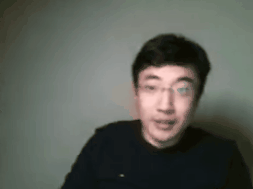
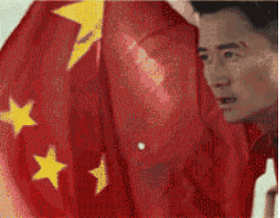
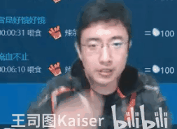
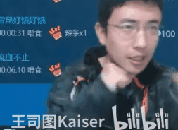
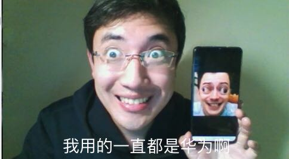
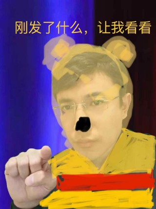

# 早该管管了！


### 老王三公理
1. 对方陈述事件A   
答：**早该AA了！** 

2. 对方说 if A then B  
答：**A就B吗？我看也未必！** 

3. 对方说A是A，B是B  
答：**A和B，其实都一样！** 

```
“老王被管起来了”  
“早该管管了！”

“戴套才安全”  
“戴套就安全吗？我看也未必！”

“小粉红和阴阳师对线”  
“小粉红和阴阳师，其实都一样！”（鲁棒之王20200504）
```

----------------------------------
<!---
### 不知道xiao

```
以前说“难得糊涂”，但糊涂给人感觉是博弈中选择了劣势策略，至少有一个博弈的过程，这就容易破坏安定团结大好局面。

还是大咕咕咕鸡的“假装不知道”比较好，假装不知道，也就没有博弈了，岁月静好就一定要实现。 （鲁棒之王20200526）
```

----------------------------------
--->

# 老王颜艺大赏

          
           
           
      

----------------------------------
